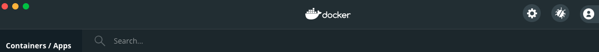
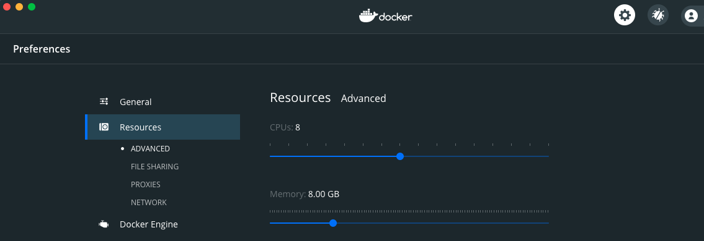
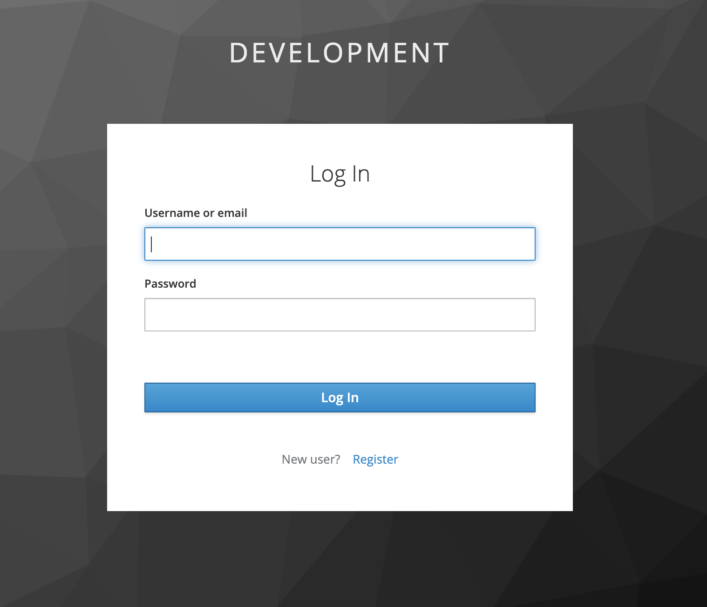
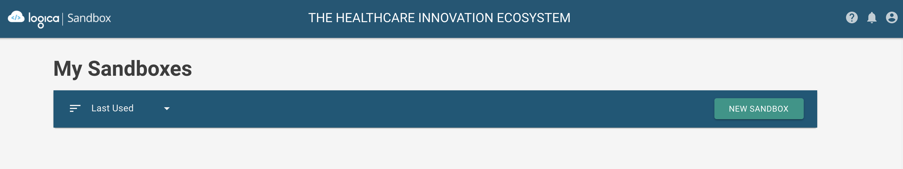
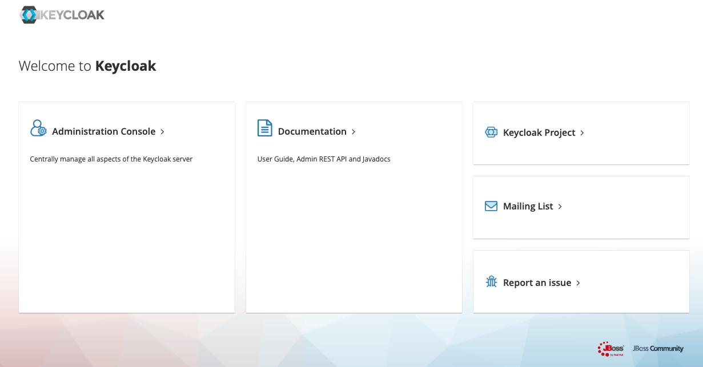
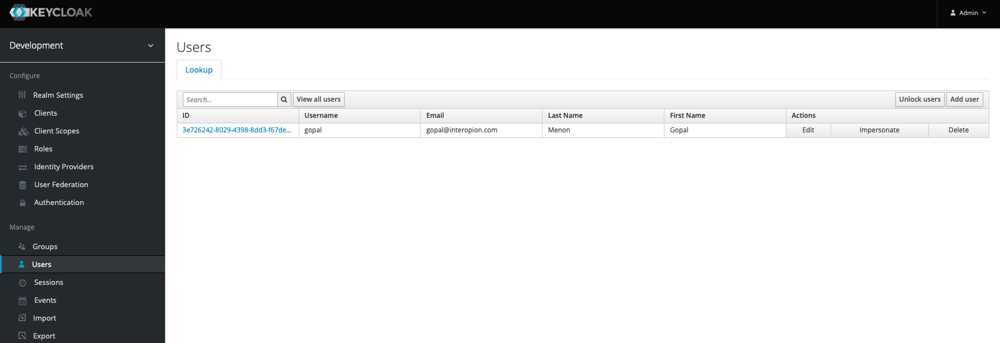
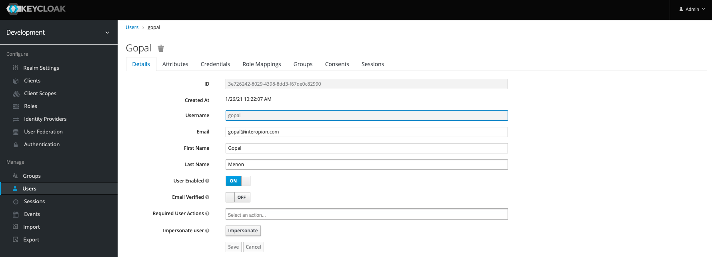
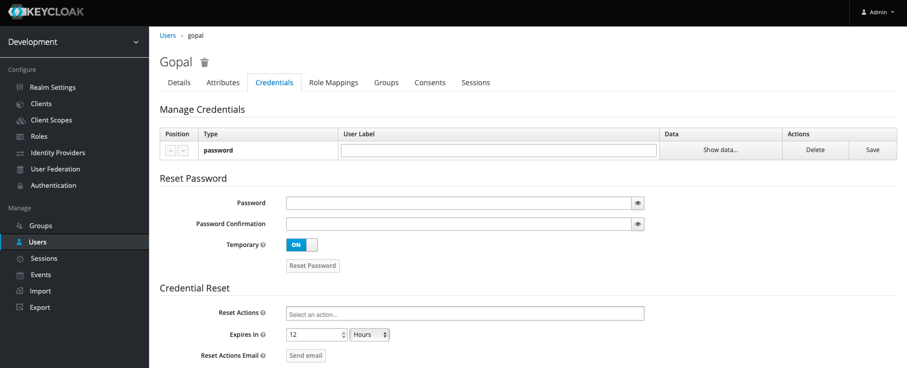

# Sandbox Community Edition
Repository for the free community edition of the sandbox

## Introduction
This document outlines downloading and installing the Logica Sandbox Community Edition and getting it running. It is broken into four sections. An  *Overview* section detailing the prerequisites to getting the system running as well as three installation sections… one each for *MacOS*, *Linux*, and *Windows* installations. Versions of the operating systems used and tested and the versions of any tools will be explicitly stated where appropriate. We recognize tools change over time and the content of this document may be out-of-date by the time you read this. We hope to give you enough information to adjust to new versions as needed. Some of the information in this document may seem remedial but we are including it anyway for those who may not be as familiar with the command line and other tools involved in the setup.

*NOTE:* The community edition is currently using HAPI 4.2.0. The Enterprise edition currently running online will soon be at HAPI 5.2.0. 

**WARNING:** Follow these instructions VERY carefully. If you miss a step… you will likely get pages and pages of errors.

## Overview
Running the sandbox locally on any OS requires the following:
* Docker (tested with Docker Desktop v3.0.4)
* MySQL container 
* Keycloak server container
* Sandbox containers
* FHIR server containers
* Application containers

In the current configuration there will be a total of 12 containers. These containers listen on specific network TCP ports as described in the next section.

### Setting up the networking environment on your machine

The sandbox makes use of the following TCP ports and may conflict with services already running on your system:
* 3000 - EHR Simulator
* 3001 - http (user interface) server
* 3306 - MySQL 5.7 database server
* 8060 - OAuth server
* 8070 - FHIR R4 server
* 8078 - FHIR DSTU2 server
* 8079 - FHIR STU3 server
* 8080 - Keycloak authentication server
* 8086 - Bilirubin Risk Chart sample app
* 8090 - Static content server
* 8096 - Patient Data Manager sample app
* 12000 - Sandbox Manager server

Stop any current services running on these ports before running the containers. A script to check for anything listening on these ports (`check-ports.sh` and `check-ports.bat`) is included in the community edition. Most conflicts will occur when a developer has something running on one of these ports. For example, if you have a MySQL server running you will likely get a conflict on port 3306.

The sandbox also uses a number of internal redirects built into the user interface requiring the following addition to the hosts file (/etc/hosts on macOS and linux):
```
127.0.0.1 keycloak
127.0.0.1 sandbox-mysql
127.0.0.1 sandbox-manager-api
127.0.0.1 reference-auth
127.0.0.1 dstu2
127.0.0.1 stu3
127.0.0.1 r4
127.0.0.1 static-content
```

This tells the web browser on the local machine that, for example, “http://r4/”  will be found listening on the local machine… assuming the container is running.

## Mac OS Install

OSX Install (tested under macOS Catalina 10.15.7):

There are two options to install Docker Desktop. Either install it by going to the website, downloading it, and running the dmg file… or install “homebrew” and then use homebrew to install it. For the minimum… just install Docker Desktop. Homebrew is a package manager for installing all sorts of tools and utilities… but you may not want it. If docker is already installed please skip ahead to setting it up to give the containers enough memory.

*NOTE:* If you want to install docker using homebrew you’ll find installation instructions in the appendix.

### Install Docker Desktop from the Docker website:

Browse to: https://www.docker.com/products/docker-desktop
Download and run the installer
	
### Configuring Docker Desktop

Run the Docker Desktop app and set the memory allocation requirements by clicking on the gear in the top right corner of the main dialog… then Resources… then ADVANCED:


Set Memory to a minimum of 8.00 GB:

Now instances will get the memory they require to run correctly. If you are running into memory issues with the containers this is most likely the culprit.

### Download and Install
1. Clone this project 
    ```sh
    git clone https://github.com/logicahealth/sandbox-community-edition.git
    ```
2. Change to the new directory
    ```sh
    cd sandbox-community-edition
    ```
### Starting the sandbox
In the same terminal window or another terminal window run the following:
   ```sh
    docker-compose up
   ```
	
This will start the services for the sandbox. At first, you will see something like the following
    
   ```sh
    Creating network "sandbox-community-edition_default" with the default driver
    Creating sandbox-community-edition_static-content_1            ... done
    Creating sandbox-community-edition_patient-data-manager_1      ... done
    Creating communityedition_sandbox-mysql                        ... done
    Creating sandbox-community-edition_bilirubin-risk-chart_1      ... done
    Creating sandbox-community-edition_keycloak_1                  ... done
    Creating sandbox-community-edition_sandbox-manager-prototype_1 ... done
    Creating sandbox-community-edition_ehr-simulator_1             ... done
   ```
The output will stay unchanged for a while the database is being seeded. After the database seeding is completed, you will see other services that depend on the database start up. Images for the containers will be downloaded from docker hub. This process may take a while the first time and produce a lot of logging output.

To check if things are running open another terminal window and run:
   ```sh
    docker-compose ps
   ```
	
You should see output like this showing the running instances and the ports they are listening on. All the states should say “Up”:
```
                        Name                                       Command                  State                             Ports                      
---------------------------------------------------------------------------------------------------------------------------------------------------------
communityedition_sandbox-mysql                          docker-entrypoint.sh mysqld      Up (healthy)   0.0.0.0:3306->3306/tcp, 33060/tcp                
sandbox-community-edition_bilirubin-risk-chart_1        docker-entrypoint.sh npm r ...   Up             0.0.0.0:8086->8086/tcp                           
sandbox-community-edition_dstu2_1                       sh -c java $JAVA_OPTS -jar ...   Up             0.0.0.0:8078->8078/tcp                           
sandbox-community-edition_ehr-simulator_1               serve -s -p 3000 build           Up             0.0.0.0:3000->3000/tcp                           
sandbox-community-edition_keycloak_1                    /opt/jboss/tools/docker-en ...   Up             0.0.0.0:8080->8080/tcp, 8443/tcp                 
sandbox-community-edition_patient-data-manager_1        docker-entrypoint.sh npm r ...   Up             0.0.0.0:8096->8096/tcp                           
sandbox-community-edition_r4_1                          sh -c java $JAVA_OPTS -jar ...   Up             0.0.0.0:8070->8070/tcp                           
sandbox-community-edition_reference-auth_1              sh -c java $JAVA_OPTS -Dja ...   Up             0.0.0.0:8060->8060/tcp                           
sandbox-community-edition_sandbox-manager-api_1         sh -c java $JAVA_OPTS -jar ...   Up             0.0.0.0:12000->12000/tcp                         
sandbox-community-edition_sandbox-manager-prototype_1   /sbin/entrypoint.sh /usr/s ...   Up             1935/tcp, 0.0.0.0:3001->3000/tcp, 443/tcp, 80/tcp
sandbox-community-edition_static-content_1              /docker-entrypoint.sh ngin ...   Up             0.0.0.0:8090->80/tcp                             
sandbox-community-edition_stu3_1                        sh -c java $JAVA_OPTS -jar ...   Up             0.0.0.0:8079->8079/tcp   
```

In a web browser (preferably Chrome) go to http://localhost:3001. You should see a Keycloak login screen like the following. Click on register and fill in your details.

You will be able to use this username and password to login to the sandbox from now on whenever you run it.

*NOTE:* If you ever lose or forget this password, look in the appendices to find out how to reset it.
After logging in, you should see the following screen with no sandboxes. Click the NEW SANDBOX button to create a sandbox.

After you have created a sandbox you will see them listed:


### Starting and stopping the sandbox
To start the services
   ```sh
    docker-compose up
   ```
In another terminal window show the running services
   ```sh
    docker-compose ps
   ```
Run the `check-ports.sh` shell script to see the services listening on ports. If you get an error saying permission is denied, then run the command `chmod +x check-ports.sh`.
```
com.docke   698 gopalmenon   83u  IPv6 0xc9b8f9c2c86d6f7      0t0  TCP *:3000 (LISTEN)
node      12898 gopalmenon   27u  IPv4 0xc9b8f9c3f637af7      0t0  TCP *:3000 (LISTEN)
com.docke   698 gopalmenon   84u  IPv6 0xc9b8f9c2c86ea17      0t0  TCP *:3001 (LISTEN)
com.docke   698 gopalmenon   85u  IPv6 0xc9b8f9c28be8d57      0t0  TCP *:3306 (LISTEN)
com.docke   698 gopalmenon   89u  IPv6 0xc9b8f9c4d1ae3b7      0t0  TCP *:8060 (LISTEN)
com.docke   698 gopalmenon   91u  IPv6 0xc9b8f9c4d1add57      0t0  TCP *:8070 (LISTEN)
com.docke   698 gopalmenon   88u  IPv6 0xc9b8f9c4d1ad6f7      0t0  TCP *:8078 (LISTEN)
com.docke   698 gopalmenon   90u  IPv6 0xc9b8f9c4d1ad097      0t0  TCP *:8079 (LISTEN)
com.docke   698 gopalmenon   87u  IPv6 0xc9b8f9c35f49a17      0t0  TCP *:8080 (LISTEN)
com.docke   698 gopalmenon   54u  IPv6 0xc9b8f9c3b0283b7      0t0  TCP *:8086 (LISTEN)
node      13020 gopalmenon   23u  IPv4 0xc9b8f9c3b09a0df      0t0  TCP *:8086 (LISTEN)
com.docke   698 gopalmenon   86u  IPv6 0xc9b8f9c35f48097      0t0  TCP *:8090 (LISTEN)
com.docke   698 gopalmenon   82u  IPv6 0xc9b8f9c227ec6f7      0t0  TCP *:8096 (LISTEN)
com.docke   698 gopalmenon   92u  IPv6 0xc9b8f9c20d0dd57      0t0  TCP *:12000 (LISTEN)
```
Use the following command to stop the services.
```sh
docker-compose stop
```
You will see something like this as the containers are stopped:
```
Stopping sandbox-community-edition_reference-auth_1            ... done
Stopping sandbox-community-edition_dstu2_1                     ... done
Stopping sandbox-community-edition_r4_1                        ... done
Stopping sandbox-community-edition_sandbox-manager-api_1       ... done
Stopping sandbox-community-edition_stu3_1                      ... done
Stopping sandbox-community-edition_keycloak_1                  ... done
Stopping communityedition_sandbox-mysql                        ... done
Stopping sandbox-community-edition_bilirubin-risk-chart_1      ... done
Stopping sandbox-community-edition_ehr-simulator_1             ... done
Stopping sandbox-community-edition_static-content_1            ... done
Stopping sandbox-community-edition_sandbox-manager-prototype_1 ... done
Stopping sandbox-community-edition_patient-data-manager_1      ... done
```

If you run the `check-ports.sh` shell script… you will see no output once the containers are stopped.

Running `docker-compose ps` will show something like the following:
```
                        Name                                       Command                State     Ports
---------------------------------------------------------------------------------------------------------
communityedition_sandbox-mysql                          docker-entrypoint.sh mysqld      Exit 0          
sandbox-community-edition_bilirubin-risk-chart_1        docker-entrypoint.sh npm r ...   Exit 0          
sandbox-community-edition_dstu2_1                       sh -c java $JAVA_OPTS -jar ...   Exit 137        
sandbox-community-edition_ehr-simulator_1               serve -s -p 3000 build           Exit 0          
sandbox-community-edition_keycloak_1                    /opt/jboss/tools/docker-en ...   Exit 0          
sandbox-community-edition_patient-data-manager_1        docker-entrypoint.sh npm r ...   Exit 0          
sandbox-community-edition_r4_1                          sh -c java $JAVA_OPTS -jar ...   Exit 137        
sandbox-community-edition_reference-auth_1              sh -c java $JAVA_OPTS -Dja ...   Exit 137        
sandbox-community-edition_sandbox-manager-api_1         sh -c java $JAVA_OPTS -jar ...   Exit 137        
sandbox-community-edition_sandbox-manager-prototype_1   /sbin/entrypoint.sh /usr/s ...   Exit 0          
sandbox-community-edition_static-content_1              /docker-entrypoint.sh ngin ...   Exit 0          
sandbox-community-edition_stu3_1                        sh -c java $JAVA_OPTS -jar ...   Exit 137    
```
## Linux Install
Install docker desktop for your distribution of Linux. 

1. Clone this project 
	```sh
	git clone https://github.com/logicahealth/sandbox-community-edition.git
	```
2. Change to the new directory
	```sh
	cd sandbox-community-edition
	```
6. Add the following rows to the file /etc/hosts using a text editor
    ```
    127.0.0.1  keycloak
    127.0.0.1  sandbox-mysql
    127.0.0.1  sandbox-manager-api
    127.0.0.1  reference-auth
    127.0.0.1  dstu2
    127.0.0.1  stu3
    127.0.0.1  r4
    127.0.0.1  static-content
    ```

    Here is an example of using nano to edit `/etc/hosts`

    ```sh
    sudo nano /etc/hosts
    ```
7. Now start the sandbox using the command
    ```sh
    docker-compose up
    ```
8. Run the following command to see a list of docker processes that are running.
    ```sh
    sudo docker-compose ps
    ```
    You should see something similar to the screen print below showing that 12 processes are with status Up.
    ```
                            Name                                       Command                  State                             Ports                      
    ---------------------------------------------------------------------------------------------------------------------------------------------------------
    communityedition_sandbox-mysql                          docker-entrypoint.sh mysqld      Up (healthy)   0.0.0.0:3306->3306/tcp, 33060/tcp                
    sandbox-community-edition_bilirubin-risk-chart_1        docker-entrypoint.sh npm r ...   Up             0.0.0.0:8086->8086/tcp                           
    sandbox-community-edition_dstu2_1                       sh -c java $JAVA_OPTS -jar ...   Up             0.0.0.0:8078->8078/tcp                           
    sandbox-community-edition_ehr-simulator_1               serve -s -p 3000 build           Up             0.0.0.0:3000->3000/tcp                           
    sandbox-community-edition_keycloak_1                    /opt/jboss/tools/docker-en ...   Up             0.0.0.0:8080->8080/tcp, 8443/tcp                 
    sandbox-community-edition_patient-data-manager_1        docker-entrypoint.sh npm r ...   Up             0.0.0.0:8096->8096/tcp                           
    sandbox-community-edition_r4_1                          sh -c java $JAVA_OPTS -jar ...   Up             0.0.0.0:8070->8070/tcp                           
    sandbox-community-edition_reference-auth_1              sh -c java $JAVA_OPTS -Dja ...   Up             0.0.0.0:8060->8060/tcp                           
    sandbox-community-edition_sandbox-manager-api_1         sh -c java $JAVA_OPTS -jar ...   Up             0.0.0.0:12000->12000/tcp                         
    sandbox-community-edition_sandbox-manager-prototype_1   /sbin/entrypoint.sh /usr/s ...   Up             1935/tcp, 0.0.0.0:3001->3000/tcp, 443/tcp, 80/tcp
    sandbox-community-edition_static-content_1              /docker-entrypoint.sh ngin ...   Up             0.0.0.0:8090->80/tcp                             
    sandbox-community-edition_stu3_1                        sh -c java $JAVA_OPTS -jar ...   Up             0.0.0.0:8079->8079/tcp   
    ```
9. Go to http://localhost:3001 on a browser to go to the sandbox. You will need to register the first time you are there. Save your user and password information.
10. To stop the sandbox
    ```sh
    sudo docker-compose stop
    ```

## Windows Install
*TODO*

## FAQ
### Something is listening on a port, and I don’t know how to kill it
*TODO*

### Lost or forgotten password 

If you do not remember your username or password, you will need to go to the Keycloak server and login as an administrator. Go to http://localhost:8080 on a browser and you will see the following screen.


Click on Administration Console and login with user `admin` and password `admin`. 

Now click on Users and View all users.


Click on the ID of your user and you will be able to see the username you need to login.


To reset your password, go to the Credentials tab.

Key in your new preferred password into Password and Password Confirmation. Toggle the Temporary setting to OFF. Click on Reset Password and press Reset password on the confirmation screen that pops up asking if you are sure. Now you can logoff as Keycloak administrator by clicking on the Admin drop down on the top right.

Go http://localhost:3001 and login with your new password.


### Containers won’t start up
*TODO*

### How do I install homebrew

Homebrew is a package manager for macOS and Linux. It turns out macOS comes with a minimal and fairly outdated set of command line tools… and no easy way to update and manage new versions. This provides a stable enough base for macOS. However, anyone who lives/eats/breathes command line… or is curious about all things UNIX… will want more. Installing Homebrew gives easy access to thousands of command line tools… and also regular macOS applications… like Docker Desktop.

#### Install homebrew
	For information about Homebrew browse to https://brew.sh
	To just skip to the chase and get it done, open a terminal and cut and paste the following commands and hit return:
	This command will install homebrew:
```sh
/bin/bash -c "$(curl -fsSL https://raw.githubusercontent.com/Homebrew/install/HEAD/install.sh)"
```

This command will install docker:
```sh
brew install --cask docker-toolbox
```
This command will install a VERY handy tool called curl:
```sh
brew install curl
```

### Memory issues:

If you are running into memory issues with the containers you need to double check you have allocated enough memory in Docker Desktop for the containers.
